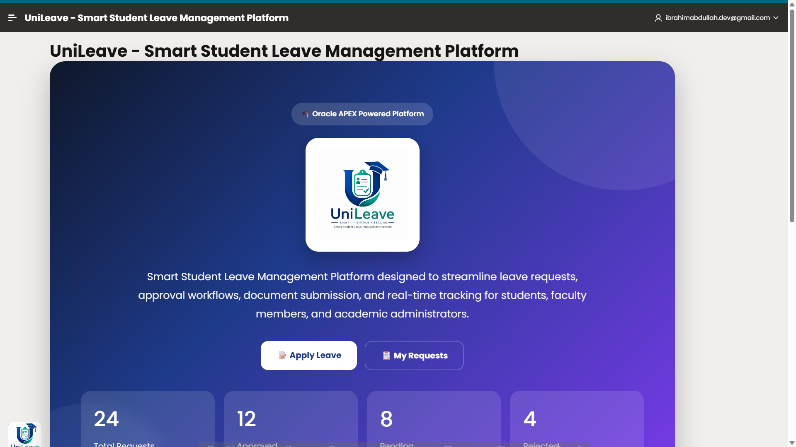
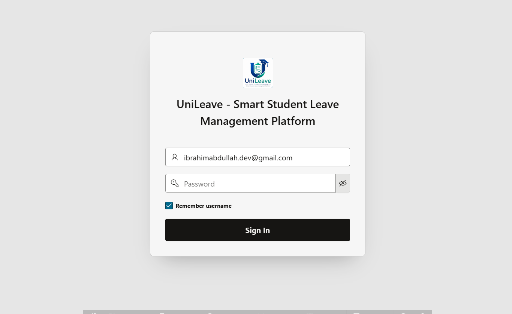
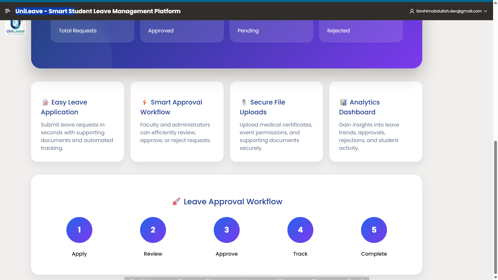
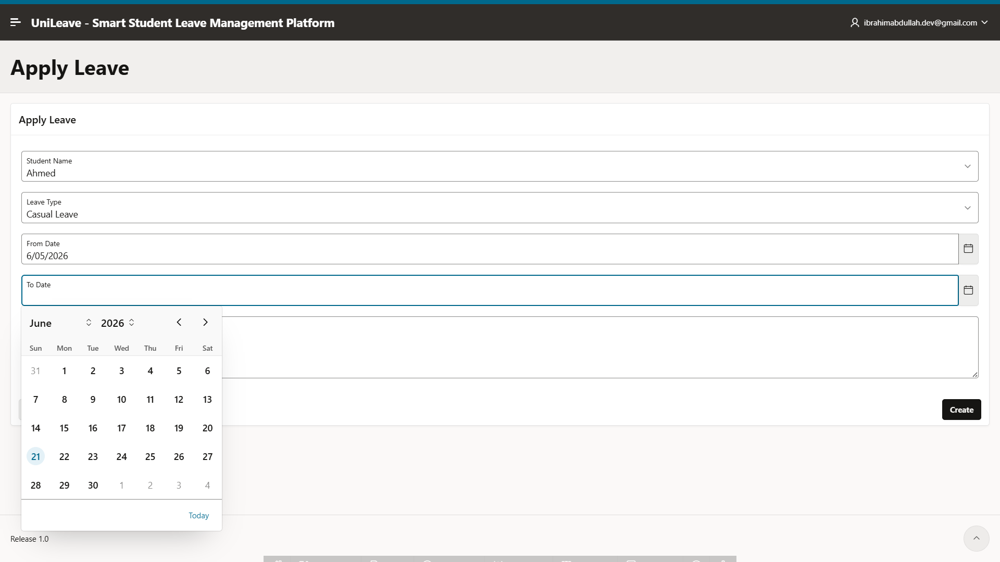
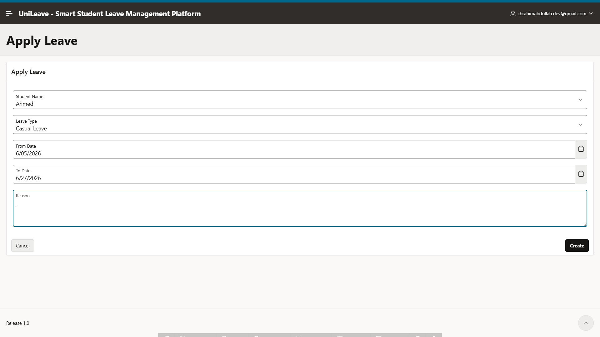
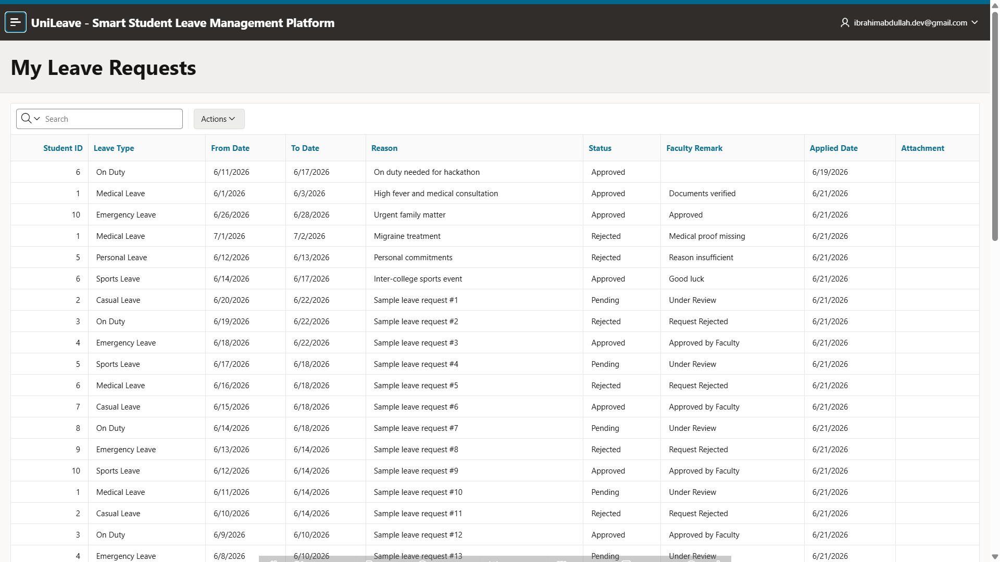
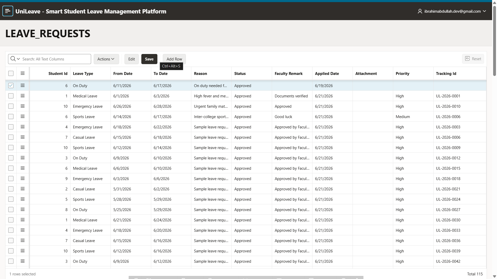
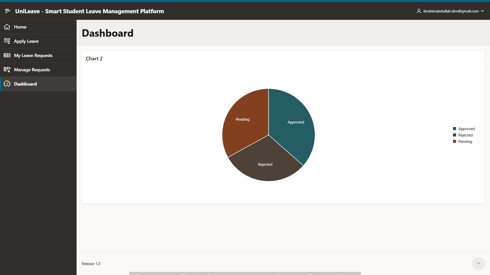

# 🎓 UniLeave - Smart Student Leave Management Platform

<p align="center">
  
</p>

<p align="center">
  <b>Digitizing Student Leave Management using Oracle APEX and Oracle Database</b>
</p>

<p align="center">


</p>

---

## 📖 Overview

UniLeave is a modern Student Leave Management Platform developed using Oracle APEX and Oracle Database.

The application simplifies and automates the leave approval process by enabling students to submit leave requests online, track request status in real time, and receive faculty feedback through a centralized workflow.

Faculty members and administrators can efficiently review, approve, reject, prioritize, and manage leave requests through interactive reports, editable grids, and dashboard analytics.

---

## ✨ Key Features

### 👨‍🎓 Student Module

* Apply for leave online
* Submit leave reasons
* Select leave categories
* Track leave status
* View faculty remarks
* Access leave history
* Generate tracking IDs

### 👨‍🏫 Faculty & Admin Module

* Review leave requests
* Approve or reject applications
* Assign priorities
* Add administrative remarks
* Monitor student requests
* Manage leave workflows

### 📊 Dashboard Analytics

* Leave Status Distribution
* Leave Type Analysis
* Pending Request Monitoring
* Approval Statistics
* Interactive Visual Reports

---

## 🏗 System Workflow

```text
Student
   │
   ▼
Apply Leave
   │
   ▼
Oracle APEX Application
   │
   ▼
Oracle Database
   │
   ▼
Faculty Review
   │
 ┌─┴─────────┐
 ▼           ▼
Approve    Reject
   │
   ▼
Status Updated
   │
   ▼
Student Tracking Portal
```

---

## 🗄 Database Schema

### LEAVE_REQUESTS

| Column         | Description                   |
| -------------- | ----------------------------- |
| LEAVE_ID       | Unique Leave Identifier       |
| STUDENT_ID     | Student Identifier            |
| LEAVE_TYPE     | Leave Category                |
| FROM_DATE      | Leave Start Date              |
| TO_DATE        | Leave End Date                |
| REASON         | Leave Reason                  |
| STATUS         | Pending / Approved / Rejected |
| FACULTY_REMARK | Faculty Feedback              |
| APPLIED_DATE   | Request Submission Date       |
| ATTACHMENT     | Supporting Document           |
| PRIORITY       | High / Medium / Low           |
| TRACKING_ID    | Unique Tracking Number        |

---

## 📸 Application Screenshots

### 🔐 Login Page



---

### 🏠 Home Page


---

### 🎨 Landing Dashboard



---

### 📝 Apply Leave



---

### 📄 Leave Application Form



---

### 📋 My Leave Requests



---

### ⚙️ Manage Requests



---

### 📊 Analytics Dashboard



---

## 🛠 Technology Stack

| Technology          | Purpose                          |
| ------------------- | -------------------------------- |
| Oracle APEX 26.1    | Low-Code Application Development |
| Oracle Database     | Backend Database                 |
| SQL                 | Data Manipulation                |
| PL/SQL              | Business Logic                   |
| Interactive Reports | Reporting & Analysis             |
| Interactive Grids   | Administrative Management        |
| Oracle Charts       | Dashboard Visualization          |

---

## 📂 Repository Structure

```text
unileave-student-leave-management
│
├── database
│   └── create_tables.sql
│
├── docs
│   ├── architecture.md
│   └── features.md
│
├── exports
│   └── unileave_apex_export.sql
│
├── screenshots
│   ├── Apply_Leave.png
│   ├── Apply_Leave2.png
│   ├── Dashboard.png
│   ├── Home-2.png
│   ├── Home.png
│   ├── Login_page.png
│   ├── Manage_Requests.png
│   └── My_leave_Requests.png
│
├── LICENSE
└── README.md
```

---

## 📦 Oracle APEX Export

The complete Oracle APEX application export is available in:

```text
exports/unileave_apex_export.sql
```

This export can be directly imported into another Oracle APEX workspace.

---

## 🎯 Learning Outcomes

Through this project I gained practical experience in:

* Oracle APEX Development
* Database Design
* SQL & PL/SQL Programming
* Dashboard Development
* Interactive Reports & Grids
* Workflow Automation
* User Experience Design
* Low-Code Application Development

---

## 🚀 Future Enhancements

* Email Notifications
* Role-Based Access Control
* Multi-Level Approval Workflow
* Leave Balance Management
* Mobile Responsive Enhancements
* Advanced Analytics Dashboard

---

## 👨‍💻 Author

### Mohamed Ibrahim

🎓 B.Tech Information Technology
🏫 Sri Ramakrishna Engineering College
☁ Oracle ACE Apprentice
🚀 AI • Cloud • Oracle APEX • Low-Code Development

### Connect With Me

* GitHub: https://github.com/MdIbuA
* LinkedIn: https://www.linkedin.com/in/mohamedibrahimbinabdullah
* Blog: https://ibrahimabdullah-dev.blogspot.com

---

⭐ If you found this project useful, consider giving it a star.
